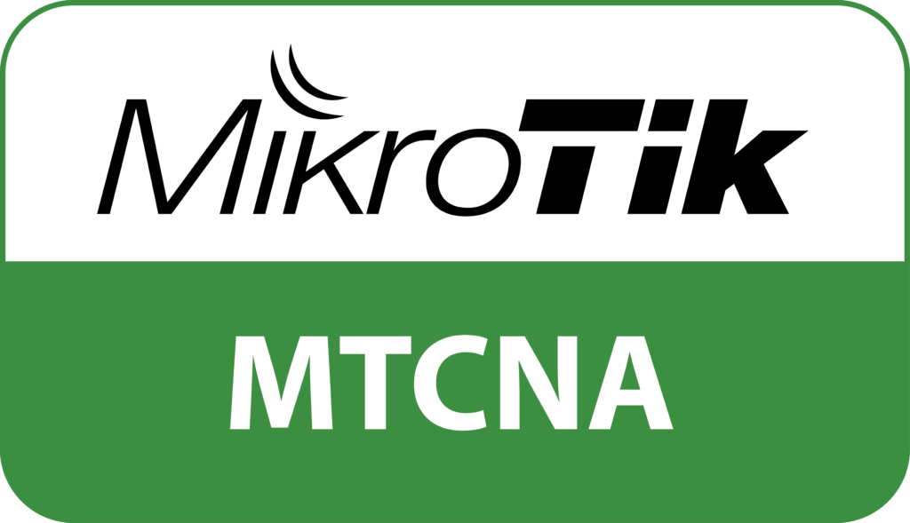

<!--## Hi there 👋-->

<!--
**muhkris404/muhkris404** is a ✨ _special_ ✨ repository because its `README.md` (this file) appears on your GitHub profile.

Here are some ideas to get you started:

- 🔭 I’m currently working on ...
- 🌱 I’m currently learning ...
- 👯 I’m looking to collaborate on ...
- 🤔 I’m looking for help with ...
- 💬 Ask me about ...
- 📫 How to reach me: ...
- 😄 Pronouns: ...
- ⚡ Fun fact: ...
-->
# Hi 👋 I'm MK

### 🛡️ Frontend Developer | Cyber Security Enthusiast

I am a **just normal humans**.

---

<table> <tr> <td align="center" width="25%"> <  Certified Network Defender  <i>EC-Council</i> </td> <td align="center" width="25%">   Certified Ethical Hacker  <i>EC-Council</i> </td> <td align="center" width="25%">   EC-Council Incident Handler  <i>EC-Council</i> </td>  <td align="center" width="25%">   MikroTik Certified Network Associate  <i>MikroTik</i> </td> </tr> </table>

## 💻 TECH STACK

<h3>🔐 CYBER SECURITY</h3>

---

<h3>🖧 NETWORKING</h3>

---

<h3>🧑‍💻 PROGRAMMING</h3>

---

<h3>🎨 FRONTEND DEVELOPMENT</h3>

## 📊 GitHub Statistics

  
  

---

> _"Security is not a product, but a process."_ 🔐
